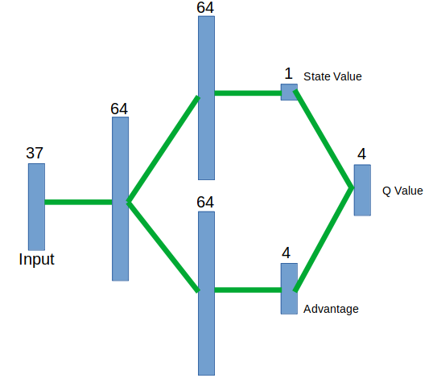

# Project Report
### Summary
This is a project that was part of a reinforcement learning course.
In this project we train a deep reinforcement learning agent to solve an environment where the agent is supposed to 
collect yellow bananas and avoid blue bananas. The agent gets +1 points for a yellow banana and -1 points for 
blue banana. Th eproblem is considered soved when the agent is able to get an average of +13 points for 100 
consucutive episodes.  

The environment is created in Unity's MLAgents toolkit and was provided as part of the project. The code for 
the DQN (deep Q network) was developed in Python using pycharm and jupyter notebook.  
 
### Learning Algorithm
Deep Q-Network (DQN) is a reinforcement learning technique, in which actions that an agent should take for a given 
state in the environment is provided by a neural network. The input to the neural network is the state and 
the outputs are values (q-values) assocaited with various actions. 
The agent chooses the action that offers maximum value. 

#### Dueling DQN
This project makes use of a dueling DQN which is a variation of the regular sequencial network. 
In this type of network, the last before the final output is split into two layers.
One layer represents the state's value and the other is the expected advantage of taking each action. 
In the final these two layers are merged into one and used as the Q-Value.

ref: Wang et al., Dueling Network Architectures for Deep Reinforcement Learning, https://arxiv.org/pdf/1511.06581.pdf

#### Double DQN
The agent makes use of double dqn optimization. This optimization helps reduce the impact of noise during the 
initial phases of training. In order to avoid any particular action getting too much adavntage due to a 
noisy high value, we find the index of the highest paying action from the local network, but the action value is 
derived from the target network for the same action.        

#### Prioritized experience replay
As the agent moves about the enviroment the State-Action-Reward-NextState (sars) sets are stored into a deque. 
During the storing operation we also calculate and store the error associated with the QValues.
During training we select sars randomly from the dequeue, but in the process we give priority to sars that have
have the largest error (i.e., we can learn most from these).

reF: Zhang and Sutton (A Deeper Look at Experience Replay, https://arxiv.org/abs/1712.01275) 

### Model Architecture
The following picture shows the neural network model that is used in the project. 

   

### Hyperparameters
The hyperparameters for the training are all stored in a class for eaze of access and readility in the code. 
The following shows the values that were used for the traning. VarParam is a small class that is used to store 
parameters that change over the duration of the training. The class takes 'initial value', 'final value', 
and 'rate of change' as parameters.

     learning_rate=0.0005,                   # learning rate
     replay_buffer_size=int(1e6),            # replay buffer size
     replay_batch_size=64,                   # minibatch size
     learn_every=4,                          # Number of environment steps between every update with experience replay
     target_update_interval=-1.0,            # The number of learning steps between updating the neural network for fixed Q targets.
                                             # Set negative to use soft updating instead.
     alpha=0.6,                              # Exponent for computing priorities in replay buffer
     error_clipping=False,                   # Flag for limiting the TD error to between -1 and 1
     gradient_clipping=False,                # Flag for clipping the norm of the gradient to 1
     reward_clipping=False,                   # Flag for limiting the reward to between -1 and 1
     epsilon=VarParam(1.0, 0.01, 0.005),     # Epsilon-greedy selection of an action. Probably for selecting a random action from the QTable
     gamma=VarParam(0.9, 0.99, 0.01),        # Discount factor (0 to 1). Higher values favor long term over current rewards.

     beta=VarParam(0.4, 1.0, 0.005),         # For prioritized replay. Corrects bias induced by weighted sampling of stored experiences.
                                             # increase to 1.0 as per Schauel et al. https://arxiv.org/abs/1511.05952
     tau=VarParam(0.001, 0.1, 0.00001)       # weighting factor for soft updating the target network in DQN.

### Result
The agent was able to solve the problem in under 700 episodes. By the end of training through 2000 episodes the agent 
was able to achieve an average score of ~16 points/episode.

### Improvement Ideas
The training seems to have stalled after about 800 episodes. I believe a lot more tuning of parameters need
 to be done.
 
Additional, improvements suggested in the 'rainbow' model should be tried out to see how the agent can be improved. 
